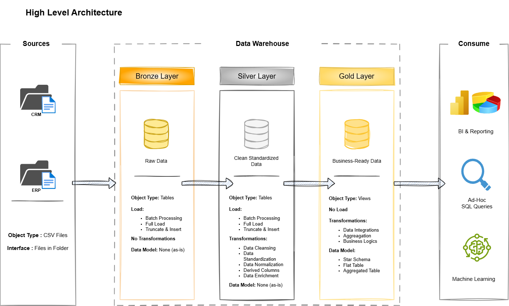

# sql-data-warehouse-project

# Data Warehousing & Analytics Project

Welcome aboard the **Data Warehousing & Analytics Project** repo! 🚀  
This project walks through an end-to-end data warehousing and analytics build — starting from the warehouse itself and ending with insights you can actually act on. It's meant as a portfolio piece showcasing solid, industry-grade practices in data engineering and analytics.

---
## 🏗️ Data Architecture

This project's architecture is built on the Medallion model, made up of **Bronze**, **Silver**, and **Gold** layers:


1. **Bronze Layer**: Holds the raw, untouched data pulled straight from source systems. Data lands here after being loaded from CSV files into a SQL Server database.
2. **Silver Layer**: Where data gets cleaned up, standardized, and normalized so it's ready for downstream analysis.
3. **Gold Layer**: Contains business-ready data shaped into a star schema, built specifically for reporting and analytics work.

---
## 📖 Project Overview

Here's what this project covers:

1. **Data Architecture**: Laying out a modern data warehouse built on the Medallion approach — **Bronze**, **Silver**, and **Gold** layers.
2. **ETL Pipelines**: Pulling data from source systems, transforming it, and loading it into the warehouse.
3. **Data Modeling**: Building out fact and dimension tables tuned for analytical querying.
4. **Analytics & Reporting**: Producing SQL-driven reports and dashboards that surface useful insights.

🎯 Whether you're a student or a working professional, this repo is a great way to demonstrate skills in:
- SQL Development
- Data Architecture
- Data Engineering  
- ETL Pipeline Development  
- Data Modeling  
- Data Analytics  

---

## 🛠️ Key Links & Tools

All of it free of charge!
- **[Datasets](datasets):** The CSV files used as the project's dataset.
- **[SQL Server Express](https://www.microsoft.com/en-us/sql-server/sql-server-downloads):** A lightweight option for hosting your SQL database.
- **[SQL Server Management Studio (SSMS)](https://learn.microsoft.com/en-us/sql/ssms/download-sql-server-management-studio-ssms?view=sql-server-ver16):** A graphical interface for working with your databases.
- **[Git Repository](https://github.com/):** Spin up a GitHub account and repo so you can version and collaborate on code smoothly.
- **[DrawIO](https://www.drawio.com/):** A tool for sketching out architecture, models, flows, and diagrams.
- **[Notion](https://www.notion.com/):** An all-purpose workspace for organizing and managing the project.

---

## 🚀 Project Requirements

### Building the Data Warehouse (Data Engineering)

#### Goal
Build a modern SQL Server-based data warehouse that brings sales data together in one place, supporting analytical reporting and smarter decisions.

#### Specs
- **Data Sources**: Pull in data from two systems — ERP and CRM — both supplied as CSV files.
- **Data Quality**: Clean up and fix data quality problems before any analysis happens.
- **Integration**: Merge both sources into one easy-to-query data model built for analytics.
- **Scope**: Only the most current data matters here; tracking historical changes isn't part of this project.
- **Documentation**: Document the data model clearly enough that both business folks and analytics teams can follow it.

---

### BI: Analytics & Reporting (Data Analysis)

#### Goal
Build out SQL-based analytics that dig into:
- **Customer Behavior**
- **Product Performance**
- **Sales Trends**

These insights give stakeholders the business metrics they need to make smarter, more strategic calls.  

For the full breakdown, check out [docs/requirements.md](docs/requirements.md).

## 📂 Repository Layout
```
data-warehouse-project/
│
├── datasets/                           # Raw datasets used for the project (ERP and CRM data)
│
├── docs/                               # Project documentation and architecture details
│   ├── etl.drawio                      # Draw.io file shows all different techniquies and methods of ETL
│   ├── data_architecture.drawio        # Draw.io file shows the project's architecture
│   ├── data_catalog.md                 # Catalog of datasets, including field descriptions and metadata
│   ├── data_flow.drawio                # Draw.io file for the data flow diagram
│   ├── data_models.drawio              # Draw.io file for data models (star schema)
│   ├── naming-conventions.md           # Consistent naming guidelines for tables, columns, and files
│
├── scripts/                            # SQL scripts for ETL and transformations
│   ├── bronze/                         # Scripts for extracting and loading raw data
│   ├── silver/                         # Scripts for cleaning and transforming data
│   ├── gold/                           # Scripts for creating analytical models
│
├── tests/                              # Test scripts and quality files
│
├── README.md                           # Project overview and instructions
├── LICENSE                             # License information for the repository
├── .gitignore                          # Files and directories to be ignored by Git
└── requirements.txt                    # Dependencies and requirements for the project
```
---
